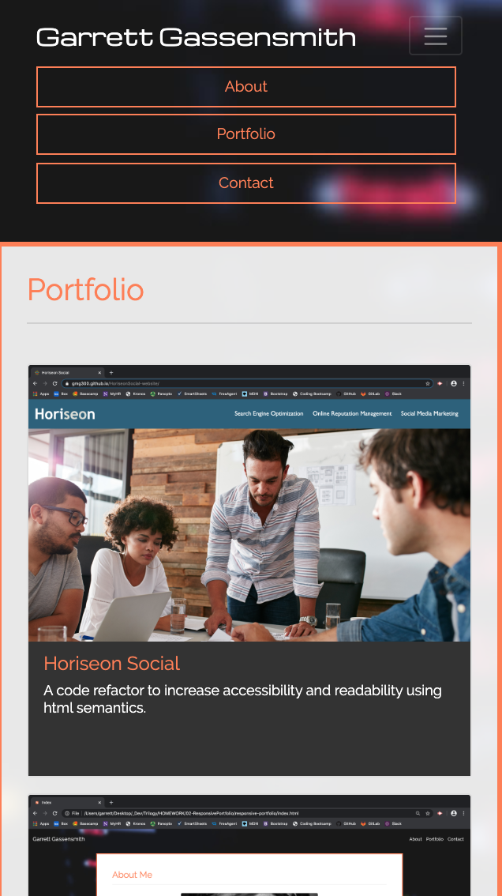
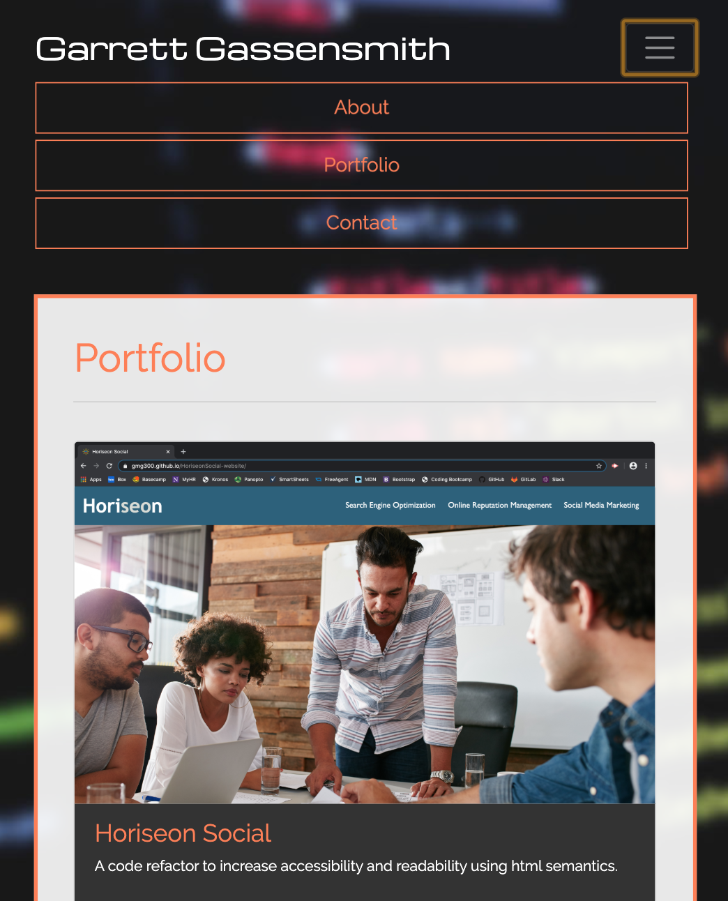
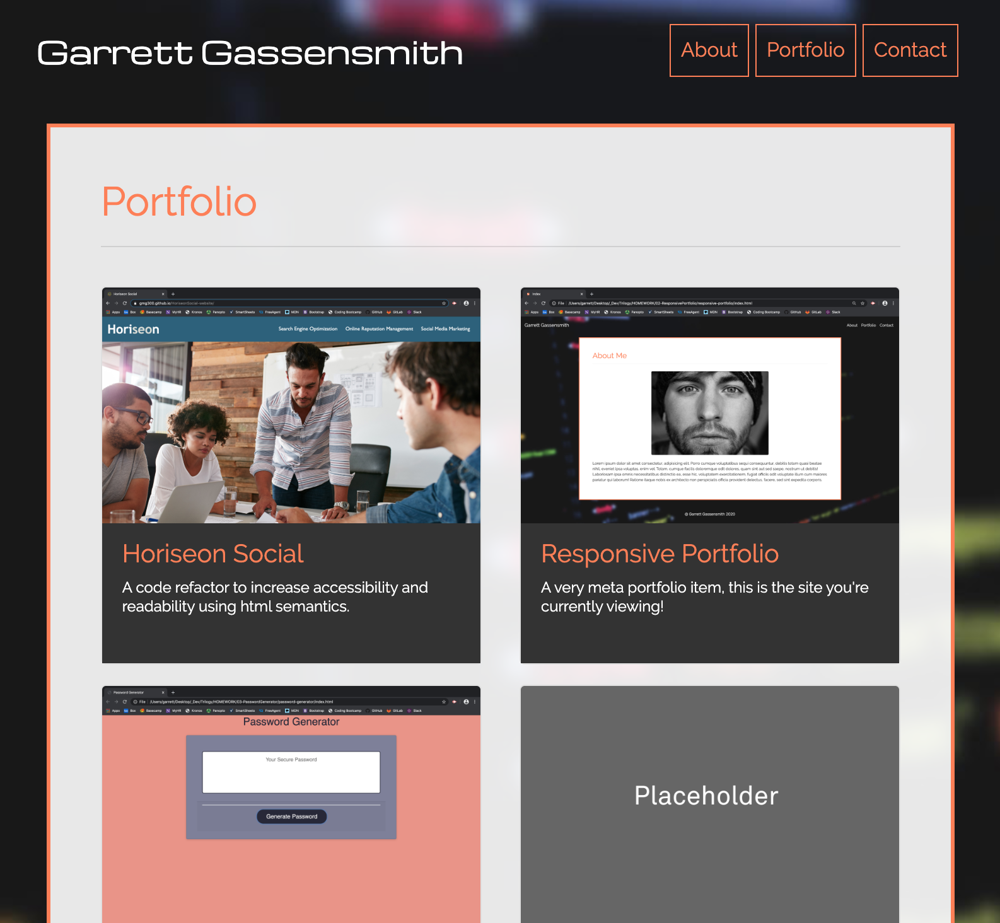
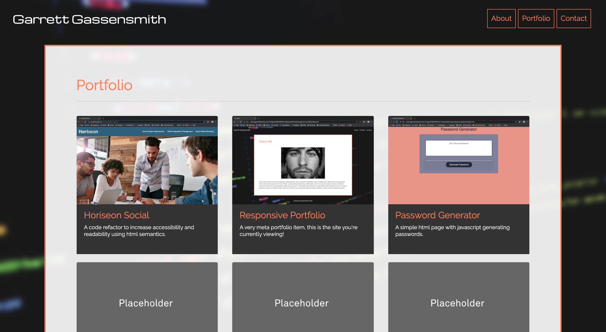

# Responsive Portfolio v0.1

 

## Description
This is my first crack at a personal portfolio website using the bootstrap CSS framework and responsive design elements. The static site contains an index, portfolio and contact page for presenting my personal information, portfolio projects and contacting me through email. 

Currently the site is not dynamic and contains no Javascript. In the future I hope to implement a back-end for storing and serving portfolio work as well as client-side validation in my contact form and other fuctionality. 

## Usage

https://gmg300.github.io/responsive-portfolio/

## Credits

GMG300
https://github.com/gmg300

Bootstrap v4.4.1
https://getbootstrap.com/
